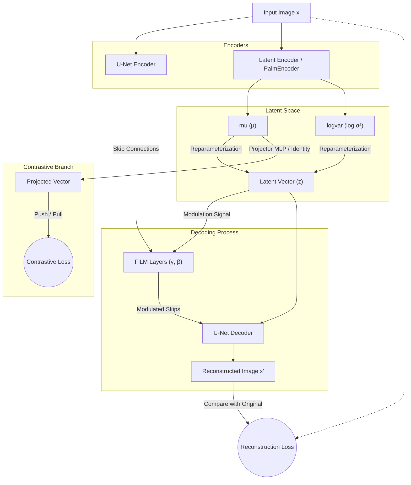

# Các Biến Tấu (Variations) Của Mạng Probabilistic U-Net 

Tài liệu này ghi chú lại cách kiến trúc U-Net truyền thống đã được biến tấu, tuỳ chỉnh để phù hợp với bài toán của chúng ta (Contrastive Learning kết hợp Generative Model).

## Sơ đồ Tổng quan (Architecture Flow)



## 1. Tách Biệt Bottleneck và Latent Encoder (Thay Giả Bằng Identity)
* **Vấn đề của U-Net truyền thống:** U-Net gốc đi từ ảnh $\to$ thu nhỏ liên tục (Encoder) $\to$ Đáy mạng (Bottleneck) $\to$ phóng to lên (Decoder).
* **Biến tấu:** 
  * Thay vì sử dụng chính phần đáy (bottleneck) của U-Net làm không gian biểu diễn, mạng của chúng ta dùng một `Latent Encoder` **độc lập hoàn toàn** (`PalmEncoder`) để trích xuất ra $\mu$ và $\sigma$.
  * Bottleneck gốc của U-Net (`down3` output) bị vô hiệu hoá hoặc "thay bằng identity" để chừa chỗ cho việc giải mã từ một vector tiềm ẩn ngẫu nhiên $z$.
  * Điều này cho phép không gian latent tập trung hoàn toàn vào việc biểu diễn đặc trưng (như ID người dùng) mà không bị vướng bận việc phải lưu giữ cả những feature rác (như background).

## 2. Lớp Projector Đa Năng Cho Contrastive Loss
Để bắt không gian $\mu$ học được cấu trúc phân cụm (cùng người thì gần nhau, khác người thì xa nhau), $\mu$ được cho đi qua một Projector (phục vụ Loss Push/Pull).

* **Biến tấu Cấu Hình:** Cấu trúc Projector không bị fix cứng, mà được điều khiển thông qua file `yaml` một cách linh hoạt:
  * Khả năng sử dụng/không sử dụng MLP (`use_mlp: True/False`). Khi set False, lớp Projector sẽ tự biến thành `nn.Identity()`.
  * Khả năng tuỳ chỉnh độ sâu và số node của từng lớp bằng mảng `hidden_dims` (vd: `[256, 128]`).
  * Khả năng tuỳ chỉnh **hàm kích hoạt (Activation)** tự động khởi tạo bằng `getattr(nn, act_name)`. Có thể dễ dàng đổi từ `ReLU` sang `GELU`, `SiLU`, hoặc `LeakyReLU` chỉ bằng việc sửa chữ trong yaml.

## 3. Điều Chế Skip Connections Bằng FiLM Layers
* **Vấn đề:** Khi tái tạo ảnh từ vector $z$ ở đáy U-Net, $z$ có thể mất mát những chi tiết cấu trúc hạt/vân tay cục bộ. U-Net giải quyết việc này bằng Skip Connections.
* **Biến tấu:** 
  * Thay vì chỉ đơn thuần là `torch.cat` (nối feature map) hoặc cộng feature map từ Encoder sang Decoder, vector không gian tiềm ẩn $z$ của chúng ta **can thiệp** trực tiếp vào các skip connections.
  * Thông qua kỹ thuật **FiLM** (Feature-wise Linear Modulation), vector $z$ sinh ra 2 ma trận $\gamma$ (Scale) và $\beta$ (Shift).
  * Feature map đi qua skip-connection sẽ được biến đổi: `x_modulated = (1 + gamma) * x + beta`.
  * Nhờ vậy, $z$ không chỉ định hướng toàn cục cho Decoder mà còn định hướng cho từng mảng chi tiết từ Encoder truyền qua.

## 4. Cơ Chế Lấy Mẫu (Sampling Modes) Đa Dạng
Việc tái tham số hoá (Reparameterization Trick) $\mu + \sigma \times \epsilon$ cũng được mở rộng để phục vụ nhiều luồng Inference:
* `stochastic`: Trạng thái huấn luyện VAE mặc định, cho phép khám phá (explore) không gian cục bộ. Có thể truyền thêm hệ số `temperature` để kiểm soát bán kính dao động.
* `deterministic`: Ép $\sigma \times \epsilon = 0 \to z = \mu$. Luôn sinh ra $z$ ổn định nhất (phục vụ cho tính toán độ đo khoảng cách, evaluate gallery/probe).
* `symmetric`: Trả về vector đối xứng qua tâm của $\mu$ (cụ thể: $-\mu + \sigma \times \epsilon$). Một variation thú vị cho các bài toán phân tích tính phản xạ của không gian tiềm ẩn.
* Công tắc `decode=True/False`: Giúp ngắt mạch không cho Decoder chạy nhằm tiết kiệm tài nguyên bộ nhớ khi chỉ cần lấy $z$ hoặc $\mu$ (Ví dụ như lúc matching).

## 5. Tương Thích Gradient Liền Mạch (Gradient Flow)
Mặc dù có nhiều nhánh tách biệt (Latent Encoder $\to \mu, \sigma$, U-Net Encoder $\to$ FiLM $\to$ Decoder, và Projector), nhưng kiến trúc bảo đảm **đạo hàm (gradient) chảy ngược liên tục** qua tất cả các khối kể cả các khối phụ như FiLM hay MLP Projector mà không bị đứt gãy. Đảm bảo huấn luyện Loss tổng ($Loss_{Recon} + Loss_{Contrastive} + Loss_{KL}$) có thể tối ưu hoá tất cả các trọng số đồng thời.

## 6. Sơ đồ Áp dụng cho Bài toán Điểm danh (Attendance / Verification Flow)
Dựa trên kiến trúc lõi ở trên, khi đưa vào thực tế để giải quyết bài toán điểm danh (xác thực danh tính), chúng ta khai thác tối đa sức mạnh của **Latent Encoder** kết hợp với tính chất **Stochastic Sampling** và **Projector**.

Vì vector sinh ra ngẫu nhiên ($z$) và giá trị trung bình ($\mu$) đóng chung một vai trò trong không gian, ta sẽ trực tiếp đưa các mẫu sinh $z$ này qua lớp `Projector` để chuyển sang không gian `Projected Vector` (nơi không gian đã được tối ưu độ phân rã bởi Contrastive Loss). Biểu diễn cuối cùng của một người sẽ là kết quả của việc huấn luyện một mô hình phụ (Auxiliary MLP hoặc SVM) dựa trên lượng lớn các mẫu sinh này.

```mermaid
graph TD
    %% Extract Phase
    X[Ảnh người dùng x] -->|PalmEncoder| Mu["mu (μ)"]
    X -->|PalmEncoder| Logvar["logvar (log σ²)"]
    
    %% Sampling Phase (Generation)
    subgraph Generative Sampling
        Mu & Logvar -->|Reparameterization| Z1["Sample z_1"]
        Mu & Logvar -->|Reparameterization| Z2["Sample z_2"]
        Mu & Logvar -->|...| Zn["Sample z_N"]
    end
    
    %% Projection Phase
    subgraph Projection Space
        Z1 -->|Projector MLP| P1["Projected v_1"]
        Z2 -->|Projector MLP| P2["Projected v_2"]
        Zn -->|Projector MLP| Pn["Projected v_N"]
    end
    
    %% Verification Phase
    subgraph VerificationPhase [Verification Training - Gallery]
        P1 & P2 & Pn -->|Train Auxiliary MLP / SVM| Verifier["Verifier Network (MLP phụ)"]
        Verifier --> R["Optimal Representation (r)"]
    end
    
    %% Inference / Matching
    Probe[Ảnh chấm công Probe] -->|PalmEncoder + Projector| P_probe["Probe Projected Vector"]
    P_probe -.->|Matching (Score)| R
```

**Chi tiết luồng điểm danh:**
1. **Trích xuất:** `PalmEncoder` phân tích ảnh 1 người ra $\mu$ và $\sigma$.
2. **Sinh mẫu ngẫu nhiên (Generative):** Dựa vào $\mu, \sigma$, mô hình sinh ra hàng trăm vector $z$ ngẫu nhiên quanh tâm $\mu$. Đây là bước "Data Augmentation" ngay trong không gian tiềm ẩn giúp mô phỏng mọi biến thể của vân tay/khuôn mặt.
3. **Phóng (Projection):** Đẩy toàn bộ các mẫu $z$ qua `Projector`. Vì Projector đã được train với Contrastive Loss, nó sẽ kéo các mẫu này thành một cụm chặt chẽ (Projected Vectors $v$).
4. **Tối ưu Đại diện (Optimization):** Mạng MLP phụ (Verifier) được huấn luyện trên cụm $N$ mẫu sinh này (Positives) đối chiếu với các mẫu nhiễu (Negatives). Kết quả của quá trình hội tụ là điểm biểu diễn chuẩn nhất $r$ cho người đó (đưa vào Database).
5. **Điểm danh (Inference):** Khi chấm công, ảnh quét đi qua `PalmEncoder + Projector` ra 1 vector duy nhất, sau đó tính khoảng cách với $r$ trong Database để ra quyết định điểm danh.
